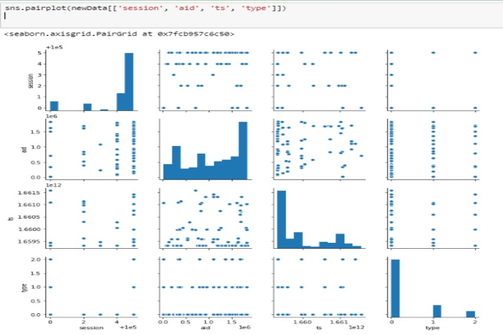

# Otto Multi-Objective Recommender
## by Mark Rosado and Samar Ashrafi
-------------------------------------------------
## Introduction
A competition hosted by OTTO, famous online-shopping in Germany to predict e-commerce Clicks, Cart Addition and Orders. The data that is given to us contains more than 5,000,000 observations containing 4 features: Session, Aid, Ts, and Type.
- Session indicates the site where a customer is on in numeric value
- Aid is the product itself but in terms of numebers, this is treated as a categorical value
- Ts is the timestamp in UNIX value 
- Type is a categorical value to display the session output either as a Click, Cart Addition or an Order   

However, one issue we had was when running the entire dataset became impossible to runbecause of the devices we had. 
The kaggle challenge provided multiple discussion topics and tips about the competition and anything related to it. 

## Preprocessing/ Exploration with the Data
We started to convert json file given from the competition and formated to the Pandas DataFrame
No nan values were included in this dataset
We also converted Type to numerical data by using 

df.replace({'clicks': 0, 'carts': 1,'orders':2}, inplace=True)

